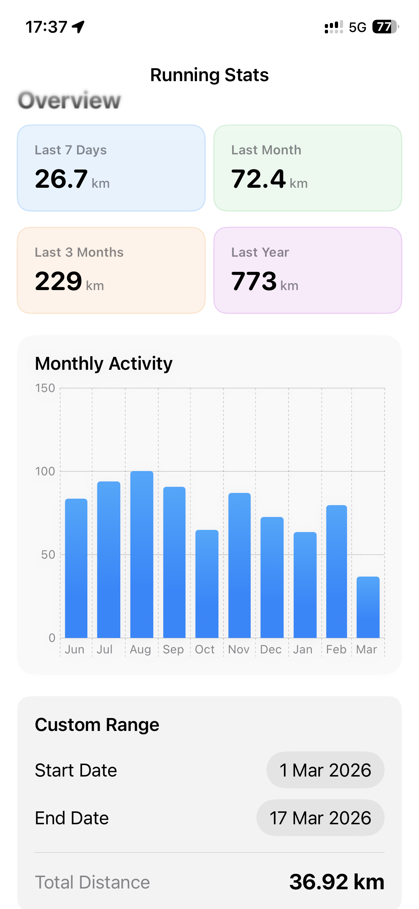

# RunningDashboard

A SwiftUI iOS app that displays running statistics by reading workout data synchronized to **Apple HealthKit** (compatible with Garmin Connect, Apple Fitness, Strava, etc.).

## Screenshots



## Features

- **Overview stats** — total running distance for the last 7 days, 1 month, 3 months, and 1 year
- **Monthly activity chart** — bar chart of distance per month over the past year (Swift Charts)
- **Custom date range** — pick any start/end date to get the total distance for that period
- Automatic **HealthKit authorization** request on first launch
- Clean MVVM architecture

## Requirements

| Requirement | Version |
|---|---|
| iOS | 26.2+ |
| Xcode | 26.0+ |
| Swift | 6.0+ |
| Frameworks | SwiftUI, HealthKit, Swift Charts |

> **Note:** This app runs on a **physical device only**. HealthKit is not available in the iOS Simulator.

## Project Structure

```
RunningDashboard/
├── RunningDashboardApp.swift   # App entry point
├── HealthKitManager.swift      # HealthKit data layer (authorization, queries)
├── DashboardViewModel.swift    # Business logic & state (@ObservableObject)
├── DashboardView.swift         # Main screen
├── MonthlyActivityChart.swift  # Bar chart component (Swift Charts)
├── StatCard.swift              # Reusable stat card component
└── ContentView.swift           # Default SwiftUI template (unused)
```

### Architecture — MVVM

```
HealthKitManager  ──►  DashboardViewModel  ──►  DashboardView
   (Model)               (ViewModel)               (View)
```

## How It Works

1. On app launch, `DashboardView` calls `requestAuthorizationAndFetchData()`.
2. `HealthKitManager` prompts the user for **HealthKit read access** to workout data.
3. Once authorized, all running workouts from the **past year** are fetched in a single query.
4. `DashboardViewModel` filters the results locally to compute the 7-day, monthly, and 3-month totals (no redundant queries).
5. Monthly data is grouped and passed to `MonthlyActivityChart` for display.
6. The **Custom Range** section triggers a new HealthKit query whenever the user changes the date pickers.

## HealthKit Permission

The app requests **read-only** access to workout data (`HKWorkoutType`). No data is written to HealthKit.

The following keys are configured in the project build settings (`Info.plist` auto-generated):

```
NSHealthShareUsageDescription — read access to workout data
NSHealthUpdateUsageDescription — declared but not used (no writes)
```

The `com.apple.developer.healthkit` entitlement is enabled in `RunningDashboard.entitlements`.

## Getting Started

1. Clone the repository:
   ```bash
   git clone https://github.com/jclabaut/RunningDashboard.git
   ```
2. Open `RunningDashboard.xcodeproj` in **Xcode 26+**
3. Select a physical iOS device as the build target
4. Build & run (`⌘R`)
5. Grant HealthKit access when prompted

## Data Source Compatibility

The app reads any running workouts stored in Apple Health, regardless of their source:

- Garmin Connect
- Apple Watch / Apple Fitness
- Strava
- Nike Run Club
- Any other app that writes workouts to HealthKit

## License

MIT
